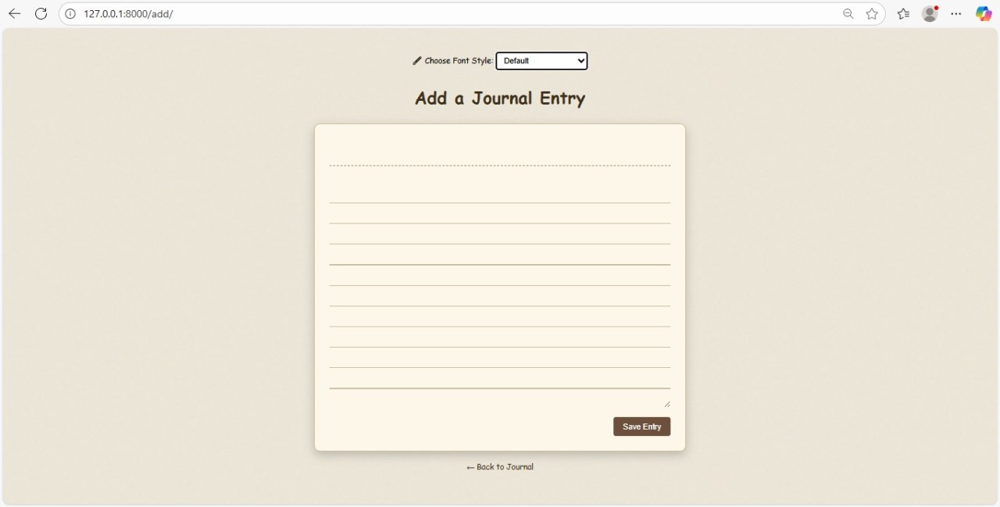
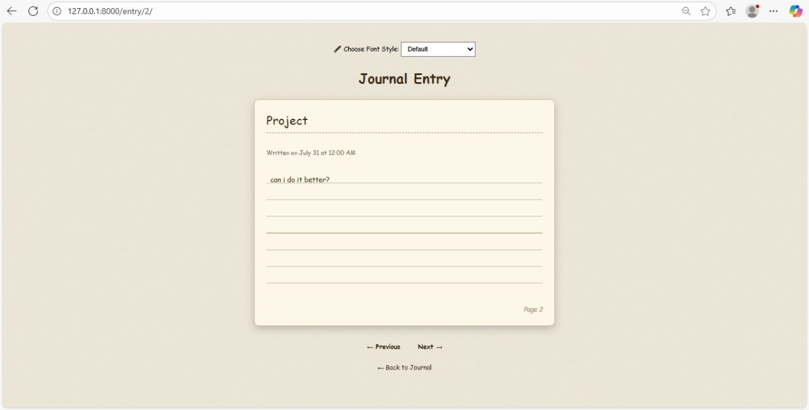
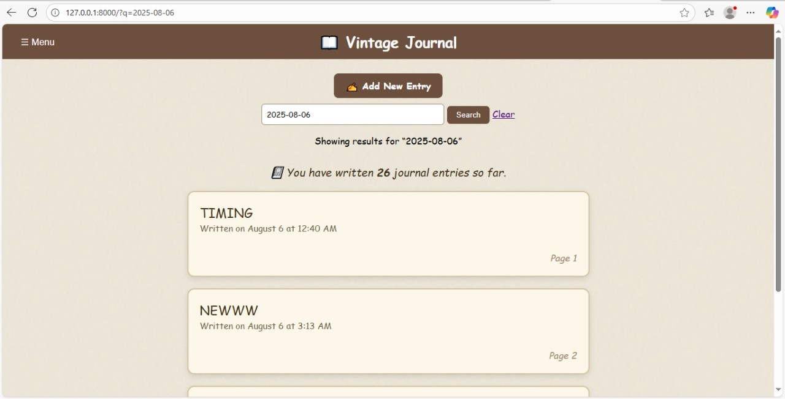
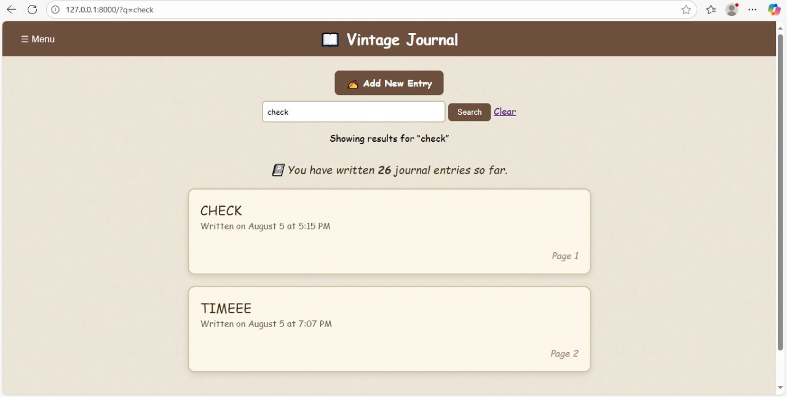
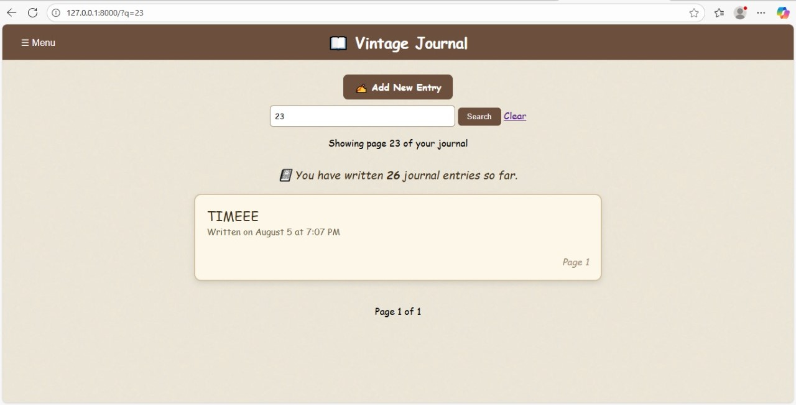
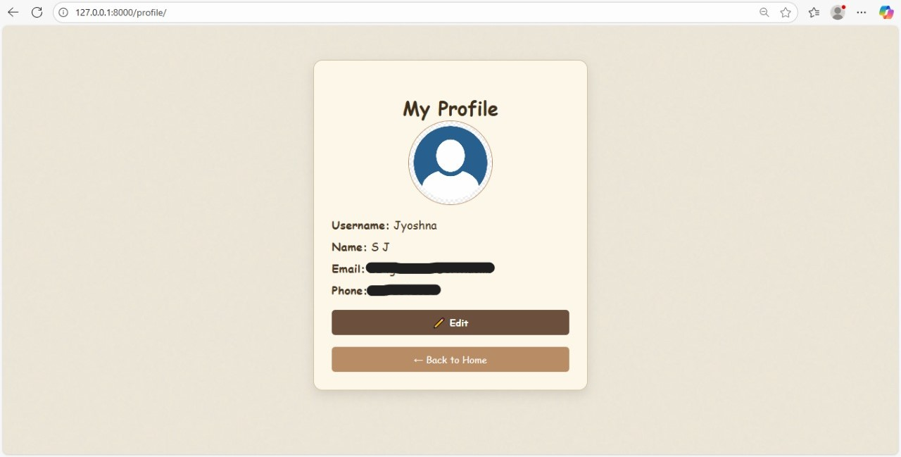
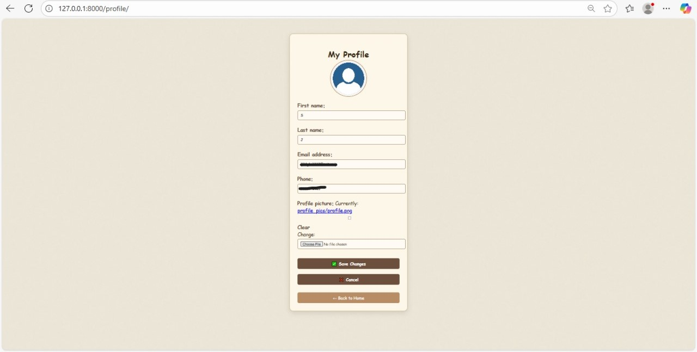
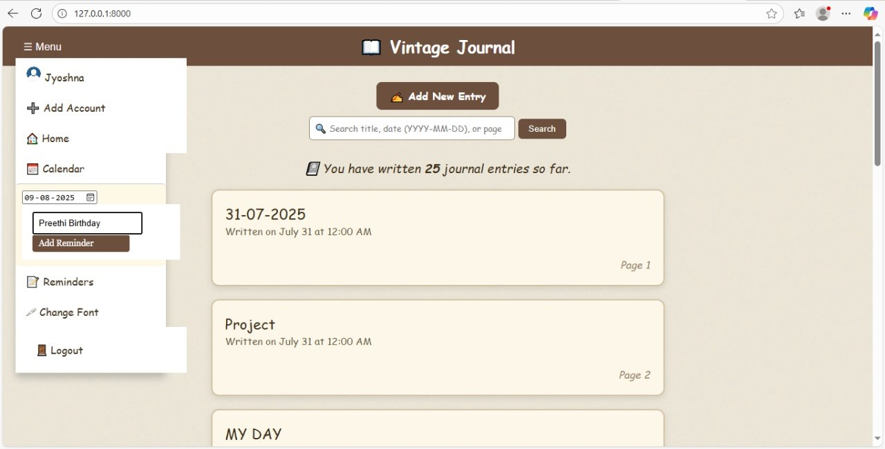
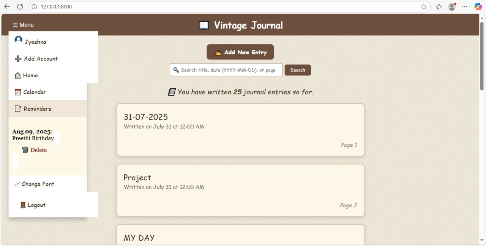
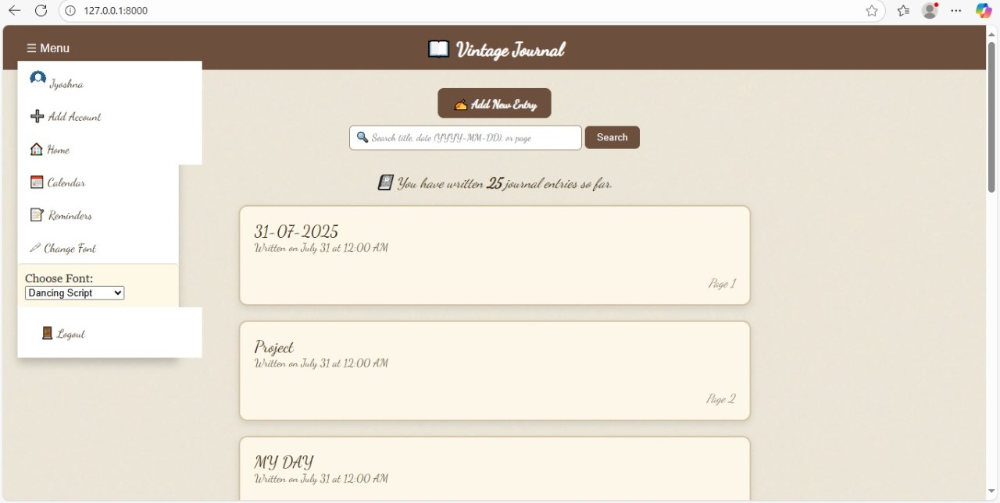

# 📖 Vintage Journal

## 🎯Project Title & Purpose:

 The title of my project is Vintage Journal. It is a personal diary/journal web application that allows users to securely write, view, and manage their daily entries in a vintage, notebook-style interface.
---
## 🖼️Screenshots:

| SCREEN                                          | DESCRIPTION                                                              |
|-------------------------------------------------|--------------------------------------------------------------------------|
|            | User Login Screen : If you dont have an account You can register         |
|      | User Register Screen : You can login after registration                  |
|      | Homepage screen along with menu bar contents also showing total entries  |
|      | Add entry Screen : You can write content by giving title                 |
|    | Viewing Entry and You Can Navigate through pages using Next and Previous |
|  | Searching entries through date                                           |
|  | Searching entries through title                                          |
|  | Searching entries through pagenumber                                     |
|  | Display Profile details when profile clicked under menu in homepage      |
|   | Profile Edit Screen                                                      |
|          | On Clicking Calender after selecting date we cann add reminders          |
|                | Reminders section : displays reminders you have added                    |
|              | You can change font using change font section                            |

---
## 🔐Key Features:
* User Authentication : Register, login, logout, and update profile with a profile picture.
* Add Entries : Users can write new journal entries with titles, content.
* View & Navigate : Entries can be viewed with page numbers, and previous/next navigation.
* Search : Users can search entries by title, content, date, or page number.
* Reminders : Users can set reminders by clicking dates on a calendar.
* Custom Fonts : Users can change the font of their journal using a dropdown.
* Real-Time Entry Count : The homepage displays the total number of entries made by the user, and this updates automatically when a new entry is added.
---
## 🛠️Tech Stack: 
* Backend : django framework 
* Frontend : HTML, CSS, JavaScript
* Database : SQLite (Default)
* LocalStorage : to remember font preferences
---
## 📌Installation & Setup:
1. Clone the repository:
   git clone https://github.com/S-Jyoshna/JournalProject.git

2. Navigate into the project:
   cd JournalProject
   cd diary_project

3. Create and activate virtual environment:
   python -m venv env
   source env/bin/activate   # On Linux/Mac
   env\Scripts\activate      # On Windows

4. Install dependencies:
   pip install django
   python -m pip install Pillow

6. Apply migrations:
   python manage.py migrate

7. Run the development server:
   python manage.py runserver

8. Open in browser:
   http://127.0.0.1:8000/
---
## 📜Usage:
1. Register a new account or log in.
2. Create journal entries and view them by page number.
3. Search entries by title, content, or date.
4. Use the calendar to add reminders.
5. Manage your profile.
